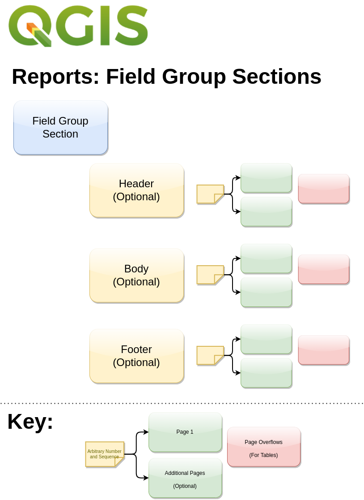

# An introduction to QGIS Reports


[](https://www.youtube.com/watch?v=rYqGYfUMfiw)

[Watch YouTube Video](https://www.youtube.com/watch?v=rYqGYfUMfiw)


This document and example files are available at [https://github.com/kartoza/QGISReportsWorkshop](https://github.com/kartoza/QGISReportsWorkshop)

## Presentation Outline

* Assumptions when viewing this talk.
* Why Reports?
* Two Examples
* Differences between Reports and Layouts
* Structure of a Report
* Report Limitations
* Live Demo (time allowing)

## Assumptions

We assume you are already familiar with:

* layouts
* atlas generation
* expressions
* some lightweight python coding is also covered here (not essential to benifit from this talk though)

## Why Reports?

One click process to create multiple atlasses combined in a single document along with arbitrary number of statically created pages.

## Two Examples:

[Smallholding Report](./MaceiraMegaReport.pdf)


[ReportBasics](./ReportBasics2.pdf)


## Key Differences between Reports and Layouts


Capability | Report |  Layout
-----------|--------|-----------
Preview atlas page by page | ❌ | ✓
Multiple pages | ✓ | ✓
Page overflows | ✓ | ✓
Multiple sections | ✓ | ❌ 
Multiple atlasses | ✓ | ❌ 
Page numbering consistent throughout document | ❌ | ✓
Generate PDF via processing algorithm| ❌ | ✓
Generate PDF via QGIS Server | ❌ | ✓
Generate PDF via Python API | ? | ✓
Export to QPT | ❌ | ✓

Also note the differences in the Atlas variables exposed.

Traditional Layout Atlas Variables:


Versus Report Atlas Variables:


To obtain the 'missing ones', you need to calculate them with expressions etc.

Also note on the last item above, you can actually export to QPT from the reports window
but it is not possible to load it again as a report - QGIS will think it is a layout.


## Structure of a Report





## Common Patterns

### Getting the atlas feature attributes e.g. name

```attribute(  @atlas_feature, 'name')```

### Highlighting the current feature

Same as for atlas:

```
if (
 @atlas_featureid = $id,
 'solid',
 'no')
```

## Report Limitations

* Page Numbering across sections difficult (see hack below)
* Reordering sections not possible so plan first!
* Not possible to save as file similar to .qpt  
* No expressions for field groups e.g. to filter them by the parent group. For this reason multi-level nesting of field groups is not practical.
* https://github.com/qgis/QGIS/issues/46278 Report variables only show after first running the report once
* Not possible to access variables relating to parent if in a subpage.
* Not possible to access the parent field groups currentfeature directly
* Not possible to produce indexes or forward page references easily (see hack below)
* Some Atlas variables only available after generating the report once

## Some Limitation Workarounds

### Page counter

Reset page counter (at start of document):

```[% reset_serial_var('page_counter')%]```

Show current page count (on each document page):

```[% serial_var('page_counter')%]```

Implemented as these custom QGIS Expressions:

```python
from qgis.core import *
from qgis.gui import *

@qgsfunction(args='auto', group='Custom')
def serial_var(variable, feature, parent):
    """
    Increments, sets and then returns the value of a project variable.
    <h2>Example usage:</h2>
    <ul>
      <li>serial_var('my_variable') -> 13</li>
    </ul>
    <p>Value of my_variable before calling the function: 12</p>
    <p>Value of my_variable after calling the function: 13</p>
    """
    project = QgsProject.instance()
    value = 0
    try:
        value = int(QgsExpressionContextUtils.projectScope(
            project).variable(variable))
        if value is None:
            value = 0
    except:
      pass
    value += 1
    QgsExpressionContextUtils.setProjectVariable(
        QgsProject.instance(), variable, value)

    return value

@qgsfunction(args='auto', group='Custom')
def reset_serial_var(variable, feature, parent):
    """
    Resets and the value of a project variable to zero.
    <h2>Example usage:</h2>
    <ul>
      <li>reset_serial_var('my_variable') -> None</li>
    </ul>
    <p>Value of my_variable before calling the function: 12</p>
    <p>Value of my_variable after calling the function: 0</p>
    """
    project = QgsProject.instance()
    QgsExpressionContextUtils.setProjectVariable(
        QgsProject.instance(), variable, 0)
    return None

```

### Table of Contents

Use a no geometry layer to store the contents list:


Pad out the section name so the table fills the page width 

```rpad( "section", 240, ' ')```

Or just set column width to e.g. 180mm


Expression to clear contents table (put in a label):

```
[% clear_contents_table() %]
```

Expression function to add section records to contents (put in a label):

```
[%add_contents_entry(
	 attribute(@atlas_feature, 'name'),
	 'page_counter' )%]
```

Adding the above to a label on the detail page for a field group report will add an entry to the report_contents table.


Implemented as these custom QGIS Expressions:

```python

@qgsfunction(args='auto', group='Custom')
def add_contents_entry(section, page_variable, feature, parent):
    """
    Adds a new row to the table of contents table.
<p>
    The table should be called 'report_contents' and be 
    structured with a 'section' and a 'page' column. No
    detailed checks are made to confirm this structure is
    in place.
</p><p>
    The page will be taken from the designated project
    variable as defined by the parameter 'page_variable'-
</p>

    <h2>Example usage:</h2>
    <ul>
      <li>add_contents_entry('Section 1','page_counter')</li>
    </ul>

<p>
    Returns None.
</p>

    """
    project = QgsProject.instance()
    page = 0
    try:
        page = int(QgsExpressionContextUtils.projectScope(
            project).variable(page_variable))
        if page is None:
            page = 0
    except:
      pass

    layer=None
    layers = QgsProject.instance().mapLayersByName('report_contents')
    if layers: 
      layer = layers[0]
    else:
      return None

    feature = QgsFeature(layer.fields())
    feature.setAttribute('section', section)
    feature.setAttribute('page', page)
    layer.dataProvider().addFeatures([feature])

@qgsfunction(args='auto', group='Custom')
def clear_contents_table(feature, parent):
    """
    Clears all the table of contents table's rows.
    <p>
        The table should be called 'report_contents'. No
        detailed checks are made to confirm table exists,
        is editable etc.
    </p>

        <h2>Example usage:</h2>
        <ul>
          <li>clear_contents_table()</li>
        </ul>

    <p>
        Returns None.
    </p>

    """
    layer=None
    layers = QgsProject.instance().mapLayersByName('report_contents')
    if layers: 
      layer = layers[0]
    else:
      return None
    with edit(layer):
        listOfIds = [feat.id() for feat in layer.getFeatures()]
        layer.deleteFeatures( listOfIds )


```

## Credits


Tim Sutton
[timlinux @ github](https://github.com/timlinux/)
[tim@kartoza.com](tim@kartoza.com)
